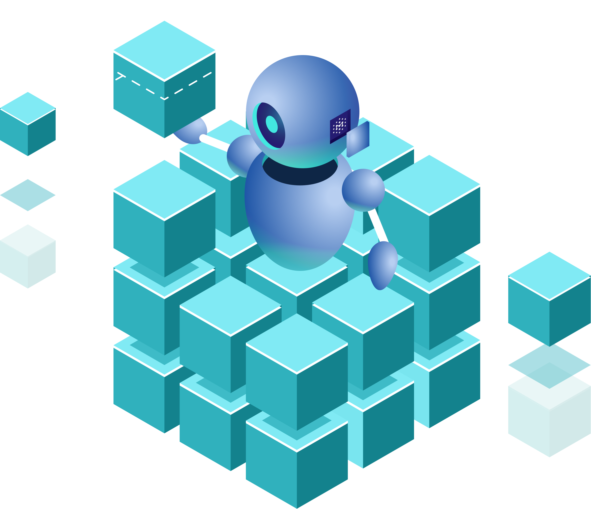

# Manifest AI-BOM Wiki

This is where we hope to build community around AI bills of material (AI-BOMs). In this repository, we have and maintain
  (1) A proposed minimum - or highly suggested - elements for AI BOMs (below)
  (2) Examples of AI-BOMs in the `/examples` folder, which contain both AI-BOM samples in existing formats (such as CycloneDX), as well as examples in our
      proposed / suggested format, which is based off of CycloneDX but has additional fields that they don't yet account for.

## Proposed AI-BOM Model

We analyzed the leading SBOM formats and various model card formats, and conducted extensive research with AI/ML experts and developers. Below is our initial proposed AI-BOM model. No existing SBOM (CycloneDX or SPDX) or model card format perfectly matches the below content, so we acknowledge there is additional work needed with those communities to align & consolidate models.

### Model Details

**Name**  [Required]
The name of the model.

**Version**  [Required]
The version of the model.

**Type**  [Required]
The type of the model. Samples include: "text-generation," "image-processing."

**Author**  [Required]
The individual or organization that developed the model. Often referred as "Developed By" in HuggingFace and other model cards.

**Licenses**  [Required]
The list of software licenses for this model (e.g. Apache 2.0, GPL 3.0, etc.)

**Libraries**  [Required?]
Any libraries that the model is dependent on. For example, in HuggingFace, models may list dependencies on libraries like PyTorch, Transformers, ONNX, Diffusers, etc.

**Source (URL)**  [Required]
A URL or other path to where this model lives, such as on a public repository.

**BOM Generation**  [Optional]
Information about how and when the BOM was generated, and who generated it: a timestamp, a method/tool, and a person/organization.

**Other references**  [Optional]
Links to other resources, such as papers, contact email addresses, websites, etc.

**Tags**  [Optional]
Tags or other labels associated with a model, which can often be scraped from HuggingFace or other repositories.

### Model Architecture

**Datasets**  [Required]
The list of datasets that were used to train the model. This should include, at a minimum, the  **name**  and  **source (URL)**  of each dataset, as well as how it can be used (e.g. license information, whether it's public or commercial, etc.). Optional information could also include the procedures used to train using each dataset.

**Architecture**  [Optional]
The model's architecture, such as "GPT-J."

**Architecture Family**  [Optional]
The family of the model's architecture, such as "Llama 2"

**Parent Model**  [Optional]
Information about the model's parent model. If present, this would include the model's  `name`,  `version`, and  `source`  (e.g. URL).

**Base Model**  [Optional]
Information about the model's base (a.k.a "foundation") model. If present, this would include the model's  `name`,  `version`, and  `source`  (e.g. URL).

**Input**  [Required]
The type of input the model accepts (e.g. "text", "images", etc.).

**Output**  [Required]
The type of output the model generates (e.g. "text", "images", etc.).

**Hardware**  [Optional]
Information about the hardware used in the model.

**Software**  [Optional]
Information about the software used in the model.

**Software Required for Execution**  [Required]
A boolean (True / False) that indicates whether a model includes software files (e.g. python, go, etc.) as part of the core files. See this how this  [model](https://huggingface.co/tiiuae/falcon-7b-instruct/tree/main)  includes python scripts as part of its listed files. Model consumers should know in advance that these additional software files may import other libraries / dependencies that could present other risks, like vulnerabilities.

### Usage

**Intended Use**  [Required]
A description of how the model should be used.

**Out of Scope Usage**  [Required]
A description of what use cases or usage of the model is not in scope for the model, and how it was developed.

**Misuse or Malicious Use**  [Required]
A description of what usage of the model constitutes misuse or malicious use.

### Considerations

**Environmental Impact**  [Optional]
Any information about the environmental impact of training or using the model, such as carbon footprint, CO2 emissions during pre-training, etc.

**Ethical Considerations**  [Optional]
Any information around ethical considerations, known or potential biases, or limitations that users should know about before using this model.

### Attestations

**Attestation**  [Optional]
A digital signature, signed by the developer of the model, to ensure the authenticity and integrity of the given AI-BOM (i.e. that it was created by the model developr, and hasn't been altered).
